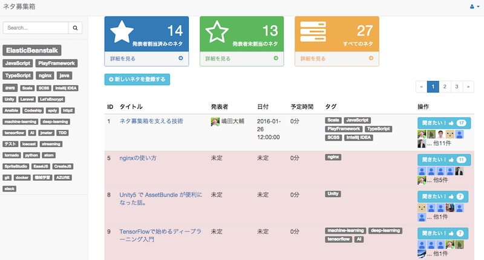

# Neta Inbox [](https://app.wercker.com/project/bykey/f47b85fae6b41b5fc944a0a1d282cb61)

This is idea box with voting feature.



## Features

- Create ideas list.
- Vote to the idea.
- Login by Google account.
- Notify to Slack and Chatwork when an idea created or updated.

## Requirements

This application depends on following technologies.

* Auth0

## Optional

* Slack and Chatwork (If there is no configuration, this application will not notify.)

## Preparing Infrastructure

* Create Auth0 accaount and your app.

## Environment Variables

You also need to set several environmental variables as follows.
The easiest way is to modify these lines in `/this-repository/docker-example/docker-compose.yml` and execute `docker-compose up -d`.

```
# required
AUTH0_CLIENT_SECRET: "your auth0 secret key"
AUTH0_CLIENT_ID: "your auth0 client id"
AUTH0_DOMAIN: "your auth0 domain"
AUTH0_CALLBACK_URL: "your auth0 callback url"
LOGIN_PERMITTED_DOMAIN: "gmail.com"
# optional
CHATWORK_API_KEY: "your chatwork api key"
CHATWORK_ROOM_ID: "your chatwork room id"
SLACK_API_TOKEN: "slack api token"
SLACK_CHANNEL_NAME: "slack channel name" # ex) "#general"
```

### Public Docker Image

You can use public Docker Image.

```
docker pull cimadai/neta-inbox:latest
```

## Run application on Docker (docker-compose)

The easiest way to run this application is use docker-comose.

```
# Edit environment variables in `/this-repository/docker-example/docker-compose.yml`.

docker-compose up -d
```

## Contributing

1. Fork the repository on Bitbucket
2. Create a named feature branch (like `add_component_x`)
3. Write your change
4. Write tests for your change (if applicable)
5. Run the tests, ensuring they all pass
6. Submit a Pull Request using Github

## License

MIT License


